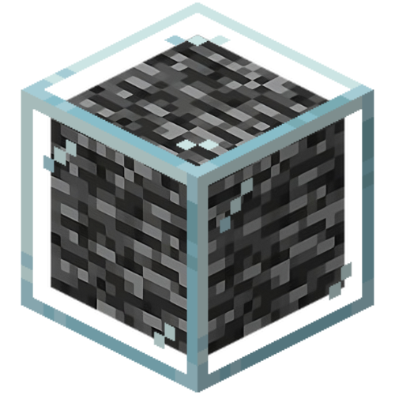

# 

  

  <h3 align="center">Bedrock SDK</h3>

  

    Create, manage and scale real dapps effortlessly.
     
     
    <a href="https://bedrocksdk.vercel.app/"><strong>Explore the docs »</strong></a>
     
     
    <a href="https://github.com/backslashs/bedrock-sdk/issues/new">Report Bug</a>
    .
    <a href="https://github.com/backslashs/bedrock-sdk/issues/new">Request Feature</a>
  

   

## Table Of Contents

- [About the Project](#about-the-project)
- [Roadmap](#roadmap)
- [Contributing](#contributing)
- [License](#license)
- [Authors](#authors)

## About The Project
The bedrock project aims to simplify the creation, implementation and management of decentralised technology through a single, modern entity. Our aim is to standardise what already works well individually into something new and easier to use, a bit like the Supabase project. 
We are convinced that the work of standardising constantly evolving protocols can save a development team a great deal of work.
The bedrock SDK therefore allows complex concepts to be abstracted into an API that is easy to use and implement in new or existing projects.

Here's how it's work:
- As if it were your backend, you create a separate repo for your frontend : this is where you define the operating modes, the features used, the smart contracts, blockchain, etc. Using the bedrock CLI, put in production and manage your decentralised infrastructure.
- For your frontend, like supabase, import our SDK and interact with your backend.
- 
*Note that the use of the word backend defines all the decentralised networks involved in the smooth running of your application.*

For more further, please refer to the [project documentation](https://bedrocksdk.vercel.app/).

## Roadmap

See the [open issues](https://github.com/backslashs/bedrock-sdk/issues) for a list of proposed features (and known issues).

## Contributing

Contributions are what make the open source community such an amazing place to be learn, inspire, and create. As the project is in its very early stages, there is no contribution guide available at the moment.
If you would still like to contribute, your help would be **greatly appreciated**.

Please also read through the [Code Of Conduct](https://github.com/backslashs/bedrock-sdk/blob/main/CODE_OF_CONDUCT.md) before posting your first idea as well.

### Creating A Pull Request

1. Fork the Project
2. Create your Feature Branch (`git checkout -b feature/AmazingFeature`)
3. Commit your Changes (`git commit -m 'Add some AmazingFeature'`)
4. Push to the Branch (`git push origin feature/AmazingFeature`)
5. Open a Pull Request

## License

Distributed under the MIT License. See [LICENSE](https://github.com/backslashs/bedrock-sdk/blob/main/LICENSE.md) for more information.

## Authors

- **TheBackSlashs** - _Young fullstack developer_ - [TheBackSlashs](https://github.com/backslashs) - _Project founder_

